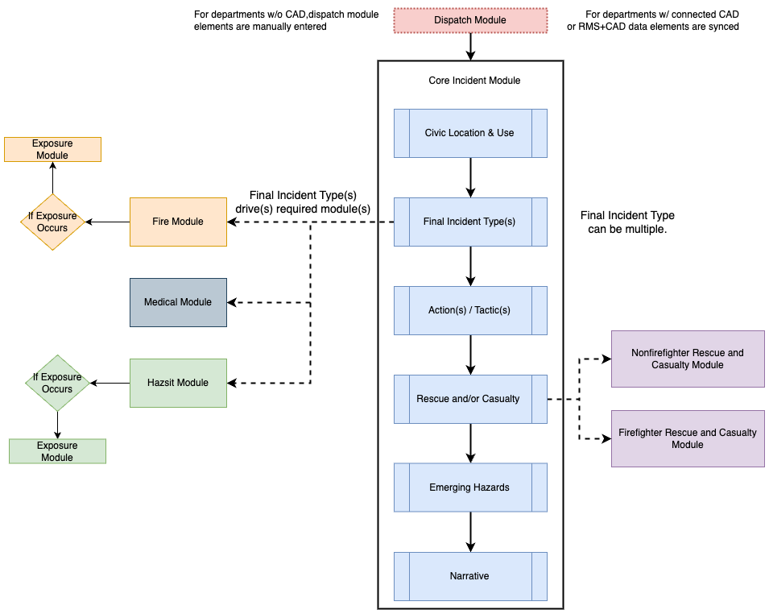
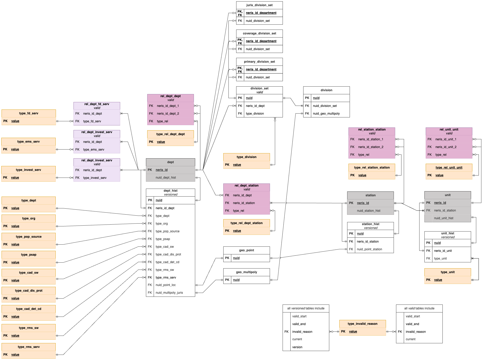

# NERIS Data Framework
This repository contains the data schema framework, currently in beta, for the National Emergency Response Information System (NERIS). This includes the Entity Specification for Fire Departments, Dispatch (CAD) Data Schema, and the Incident Data Schema. The schemas are broken down into modules and value sets. Modules define the data elements (i.e., what is being asked) and value sets are choices users can select (i.e., the choices in the drop down). Two file formats are included for ease of use: csv and yml.

## Module Flow
The following shows the logical flow of modules for creation of an incident record in NERIS.

## Entity Relationship Diagrams
An entity relationship diagram (ERD) represents database tables and the  logical relationships between them. ERDs for the database in which framework data will be stored are shown below. Only primary and foreign keys, and other fields essential to structure, are included. 

These are works in progress, and will continue to evolve as the database and API continue to be developed.

### Entity Specification

### Dispatch, Incident, and Associated

